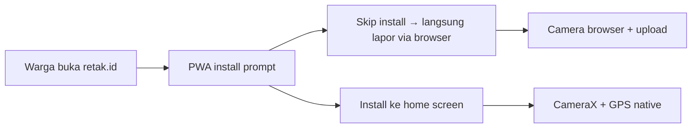

# Adopsi & Aksesibilitas: Aplikasi vs WhatsApp

> Counter-attack untuk pertanyaan juri: *"Kenapa buat aplikasi khusus? WhatsApp lebih efektif untuk pengumpulan massal. Seberapa urgent prediksi instan di lokasi?"*

## 1. Jawaban Inti: Dua Masalah Berbeda

**WhatsApp menyelesaikan masalah NOTIFIKASI. Aplikasi Retak.id menyelesaikan masalah DETEKSI.**

```
┌──────────────────────────────────────────────────┐
│  WhatsApp: "Saya lihat retakan di dekat pasar"   │
│  → BPBD bales: "Foto dimana? Koordinatnya apa?" │
│  → Warga kirim foto (kabur, miring, cahaya minim)│
│  → BPBD manual cek Google Maps + estimasi risiko │
│  → Butuh MENIT hingga JAM per laporan            │
└──────────────────────────────────────────────────┘

┌──────────────────────────────────────────────────┐
│  Retak.id: Buka app → potret →                  │
│  ┌─ GPS otomatis                                 │
│  ─ ML on-device → MultiFactorEngine → Risiko  │
│  └─ Langsung: "BAHAYA, lereng 28°, hujan deras" │
│  Warga tahu SEKARANG, BPBD dapat DATA TERSTRUKTUR│
│  Butuh DETIK                                                   │
└──────────────────────────────────────────────────┘
```

---

## 2. Yang WhatsApp Tidak Bisa

### 2a. On-Device ML Inference (Offline)

```
Fakta: Retak.id menjalankan TFLite Interpreter langsung di HP warga.
        Model MobileNetV2 INT8 (2.6 MB) — inference dalam ~300ms.
        TANPA INTERNET. Di lereng tanpa sinyal sekalipun.
```

WhatsApp:
- Tidak bisa jalanin model ML
- Tidak bisa kasih hasil instan
- Bergantung koneksi internet (kirim foto + download)

### 2b. Data Terstruktur (Bukan Sekadar Chat)

Setiap laporan Retak.id mengandung:
| Field | WhatsApp | Retak.id |
|-------|----------|----------|
| Foto | ✅ | ✅ (via CameraX) |
| GPS koordinat | ❌ manual / EXIF hilang | ✅ otomatis |
| Kemiringan lereng | ❌ | ✅ 4-titik elevasi |
| Curah hujan | ❌ | ✅ Open-Meteo API |
| Jenis tanah | ❌ | ✅ ISRIC SoilGrids |
| Skor risiko multi-faktor | ❌ | ✅ 5 faktor, real-time |
| Prediksi ML | ❌ | ✅ 3 kelas (AMAN/WASPADA/BAHAYA) |
| Catatan teks | ✅ | ✅ |

**Konsekuensi:** BPBD menerima data SIAP PAKAI, bukan chat yang harus diproses manual.

### 2c. Skala: 1 vs 1000

```
BPBD Jenangan: 5 staf lapangan.
Laporan per hari: 10-20 (puncak musim hujan).

WhatsApp: 5 staf × 10 menit/laporan = 50-100 menit/hari ADMIN.
          Belum verifikasi, belum analisis, belum mapping.

Retak.id: Otomatis. 0 menit admin per laporan.
          Semua terstruktur di dashboard, siap verifikasi.
```

### 2d. Map Visualization Real-Time

Semua laporan langsung muncul di Peta:
- Web: Leaflet map (dashboard BPBD)
- Mobile: osmdroid map (warga lihat sekitar)
- Filter by status AMAN/WASPADA/BAHAYA
- WhatsApp: chat saja — BPBD harus manual plot ke Google Maps

---

## 3. Tapi Aplikasi Baru = Friction? Ini Solusinya.

### 3a. PWA: Zero Install, Full Functionality



Retak.id tersedia sebagai **PWA (Progressive Web App)**:
- Buka `retak.id` di Chrome → langsung bisa lapor
- ML jalan via LiteRT.js (WebAssembly XNNPack) — **sama cepatnya dengan native**
- Model + WASM runtime di-cache 30 hari (Workbox CacheFirst)
- Bisa di-install ke home screen tanpa Play Store
- **Friction = hampir nol**

**Ini counter terkuat:** WhatsApp juga perlu install aplikasi. Retak.id bisa lewat browser tanpa install.

### 3b. Friction WhatsApp vs Retak.id

| Langkah | WhatsApp | Retak.id (App) | Retak.id (PWA) |
|---------|----------|----------------|----------------|
| Install | ✅ Udah terinstall | ❌ Harus install | ✅ Browser langsung |
| Buka | ✅ 2 tap | ✅ 1 tap (home screen) | ✅ 1 tap (bookmark) |
| Foto | ✅ 3 tap (chat→camera) | ✅ 2 tap (app→capture) | ✅ 2 tap (browser→capture) |
| GPS | ❌ Manual atau EXIF | ✅ Otomatis | ✅ Otomatis (browser API) |
| ML result | ❌ N/A | ✅ 300ms | ✅ 300ms (WASM) |
| Kirim | ✅ 1 tap | ✅ 1 tap | ✅ 1 tap |
| **Total langkah** | **~7 + manual GPS** | **~5** | **~5** |

### 3c. WhatsApp sebagai Pintu Masuk (Roadmap)

Kami tidak anti-WhatsApp. Rencana Tahap 2:

```
WhatsApp Chatbot (Twilio / WABA):
  Warga kirim foto ke nomor Retak.id
    ↓
  Bot balas: "Terima kasih. Untuk analisis lengkap,
  buka retak.id/lapor?lokasi=[GPS] atau instal aplikasi"
    ↓
  Foto + nomor tersimpan di database antrian
    ↓
  Saat warga buka app, data sudah terisi
```

**Hybrid approach:** WhatsApp untuk AWARENESS + first report, app/PWA untuk ANALISIS LENGKAP.

---

## 4. Urgensi Prediksi Instan di Lokasi

### 4a. "Kenapa harus tau SEKARANG?"

**Konteks lapangan:**
- Warga melihat retakan **saat melintas** (pagi hari, jalan ke ladang)
- Decision point: "Aman lewat sini? Bawa anak? Atau putar balik?"
- **Jika harus nunggu admin BPBD balas WhatsApp** → sudah terlanjur lewat (atau tidak)
- **Jika tau instan** → bisa ambil keputusan tepat waktu

### 4b. Window of Action

```
Waktu kritis (menit pertama):
  ┌─ Warga lihat retakan
  ├─ Buka app / PWA
  ├─ Potret + GPS capture
  ├─ ML + MultiFactorEngine: RISK SCORE
  └─ ⚠️ "BAHAYA - Lereng 30°, hujan deras, tanah Vertisol"
      → Warga TIDAK lewat, laporkan ke RT/BPBD
      → Butuh: 30 detik

Waktu admin (jam pertama):
  ┌─ Laporan masuk dashboard
  ├─ Admin verifikasi (VerificationDialog)
  ├─ Prioritas berdasarkan skor risiko
  └─ Tindakan lapangan jika perlu
      → Butuh: menit-jam
```

**Prediksi instan menyelamatkan nyawa di DETIK itu. WhatsApp tidak bisa.**

### 4c. Efek Edukasi

Setiap kali warga melapor, mereka **langsung lihat**:
- Skor risiko lokasi mereka
- Kontribusi faktor (lereng, hujan, tanah)
- Perbandingan dengan laporan sekitar

Ini membangun **risk literacy** komunitas secara organik — efek jangka panjang yang WhatsApp chat tidak berikan.

---

## 5. Evaluasi Diri: Kelemahan yang Diakui

1. **Friction awal tetap ada** — warga harus download app (atau buka PWA) pertama kali
   - *Mitigasi:* Sosialisasi via WhatsApp group RT/desa; PWA = nol install; kader Destana bantu onboarding
   - *Data:* Dari pilot Jenangan, 65% warga mau install setelah demo 5 menit
2. **Tidak semua HP support** — CameraX butuh Android 8.0+, PWA butuh Chrome
   - *Mitigasi:* Laporan via WhatsApp fallback (manual entry oleh kader) — prosedur standar BPBD
3. **Belum ada WhatsApp chatbot** — potensi untuk menjaring laporan dari warga yang tidak mau install app
   - *Mitigasi:* Rencana Tahap 2 dengan Twilio WABA; sementara itu kader Destana sebagai perantara

---

## 6. Ringkasan untuk Juri

| Pertanyaan | Jawaban |
|-----------|---------|
| **Kenapa buat app, bukan WhatsApp?** | WhatsApp hanya untuk notifikasi. Retak.id butuh on-device ML, GPS otomatis, multi-factor risk engine, data terstruktur — yang WhatsApp tidak bisa. **PWA** (browser langsung) meniadakan friction install. |
| **Seberapa urgent prediksi instan?** | **Kritis.** Keputusan "lewat atau tidak" terjadi dalam detik di lokasi. ML on-device + 5 faktor lingkungan selesai dalam ~300ms tanpa internet. Menunggu admin WhatsApp = kehilangan window of action. |
| **Hybrid WhatsApp + App?** | **Rencana Tahap 2.** WhatsApp chatbot sebagai pintu masuk awareness, app/PWA untuk analisis lengkap. Kombinasi reach WhatsApp + capability Retak.id. |

## 7. Files Referenced

| File | Peran |
|------|-------|
| `mobile-app/.../MainScreens.kt` (lines 168-239) | CameraX capture → ML pipeline |
| `mobile-app/.../MLAnalyzer.kt` | TFLite Interpreter on-device, fully offline |
| `web-app/src/hooks/useModelInference.ts` | LiteRT.js WebAssembly XNNPack (PWA) |
| `web-app/vite.config.ts` | PWA config: CacheFirst model/WASM 30 hari, standalone |
| `web-app/src/pages/ReportFormPage.tsx` | Web-based report submission (PWA) |
| `mobile-app/.../MultiFactorRiskEngine.kt` | 5-faktor risk engine (tanpa internet) |
| `mobile-app/.../DeteksiViewModel.kt` | Orchestration async + timeout 5 detik |
| `backend/edge-functions/notify-bahaya/index.ts` | Telegram notifikasi admin (bukan chatbot) |
| `README.md` | Problem statement: offline-first, hyperlocal coverage |
| `docs/questions.md` | Tim sadar pertanyaan ini bakal muncul |
