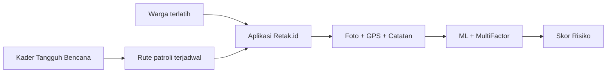

# Cakupan Data & Blind Spot Mitigasi

> Counter-attack untuk pertanyaan juri: *"Bagaimana menangani blind spot di area yang tidak terjangkau aktivitas warga? Kenapa tidak pakai drone?"*

## 1. Jawaban Inti: Dua Lapis Pertahanan

Kami mengakui **sampling bias** sebagai kelemahan inherent crowdsourcing. Namun, Retak.id dirancang dengan **dua lapis mitigasi**: sistemik (MultiFactorRiskEngine) dan partisipatif (crowdsourcing strategy).

### Blind spot di area hulu/lereng curam itu RISIKO TINGGI secara geofisika — justru itulah yang ditangkap oleh faktor lingkungan.

```
Contoh: Area hulu dengan kemiringan >25°, curah hujan >30mm/hari
         ⚠️ Risiko tetap TINGGI meskipun TIDAK ADA laporan warga
         karena SLOPE (20%) + RAIN (15%) + ELEVATION (10%) = 45% bobot
```

---

## 2. Mitigasi 1: MultiFactorRiskEngine — Risk Coverage Tanpa Laporan

### 2a. Bobot Faktor Lingkungan (45% dari total)

| Faktor | Bobot | Mekanisme | Relevansi Blind Spot |
|--------|-------|-----------|---------------------|
| **Kemiringan Lereng** | 20% | Open-Meteo API → 4 titik elevasi → kalkulasi slope | Semua koordinat (ada/tidak laporan) tetap dihitung |
| **Curah Hujan** | 15% | Open-Meteo API → forecast + current rain | Berbasis lokasi, independen dari laporan |
| **Elevasi** | 10% | Open-Meteo API → SRTM-derived elevation | Daerah hulu >1000m otomatis skor tinggi |
| **Jenis Tanah** | 5% | ISRIC SoilGrids → 17 WRB classes | Tanah rentan (Vertisols=1.0) tetap terdeteksi |

**Implikasi:** Jika suatu area memiliki kemiringan 30° + hujan lebat + tanah Vertisols — skor risiko tetap **TINGGI** meskipun nol laporan masuk. Sistem tidak "buta" terhadap blind spot; **laporan warga hanya menambah bobot ML (50%)** di atas fondasi lingkungan.

### 2b. Safety Net: AMAN Score Floor = 0.1

```
Risk Score = ML(0.5) + SLOPE(0.2) + RAIN(0.15) + ELEV(0.1) + SOIL(0.05)
Score AKHIR = max(0.1, Score)   ← AMAN tidak pernah 0
```

Bahkan jika ML bilang AMAN (confidence 100%), skor akhir minimal **0.1** — memastikan lingkungan tidak pernah diabaikan.

### 2c. Graceful Degradation

Jika laporan dari area blind spot akhirnya masuk (meski terlambat), sistem tetap bisa menilainya dengan data lingkungan yang sudah dikumpulkan dari API publik. Tidak ada ketergantungan mutlak pada input warga.

---

## 3. Mitigasi 2: Strategi Crowdsourcing Bertarget

### 3a. "Heatmap Coverage" — Dashboard Blind Spot

(Proposed — dapat diimplementasikan dalam 2-3 hari)

```
Peta dashboard menunjukkan area yang belum pernah dilaporkan
sebagai overlay transparan — staf BPBD bisa mengarahkan
sosialisasi ke area tersebut.
```

Teknis:
- Query `laporan` → dapatkan bounding box semua titik
- Bandingkan dengan grid desa/kelurahan (data BPS/BNPB publik)
- Tandai desa tanpa laporan dalam 30 hari terakhir
- Ekspor sebagai target sosialisasi

### 3b. Prioritas Verifikasi Berdasarkan Faktor Lingkungan

Sistem saat ini sudah bisa memberi prioritas pada laporan dari area berisiko tinggi berdasarkan skor lingkungan — meskipun prediksi ML rendah.

```
Flow:
  Laporan masuk (koordinat sembarang)
    ↓
  Hitung SLOPE + RAIN + ELEV + SOIL
    ↓
  Jika skor lingkungan ≥ 0.6 (TINGGI):
    → Tandai "Prioritas Verifikasi" di dashboard admin
    → Admin tahu area ini perlu dicek walau ML bilang AMAN
```

### 3c. Kampanye Partisipasi Terjadwal

Integrasi dengan `daily-summary` edge function:

```
"Wilayah Desa X (lereng utara) belum ada laporan
 dalam 30 hari. Warga sekitar diminta melaporkan
 kondisi lereng terdekat."
```

---

## 4. Counter-Attack: Kenapa Tidak Drone?

### Jawaban Singkat

**Drone belum cost-effective untuk tahap ini.** Berikut analisisnya:

### 4a. Biaya vs Cakupan

| Aspek | Drone (DJI Mavic 3E) | Crowdsourcing (Retak.id) |
|-------|---------------------|-------------------------|
| **Biaya perangkat** | Rp 40-80 juta/unit | Rp 0 (HP warga) |
| **Operator** | 1 pilot + 1 analis | 0 (warga melapor pas lewat) |
| **Cakupan per misi** | ~50 Ha (30 menit terbang) | Jaringan jalan warga (ribuan Ha/hari) |
| **Frekuensi** | 1-2x/minggu (biaya operasional) | Real-time (setiap kali lewat) |
| **Deteksi** | Visual (foto/video) | Visual + konteks lokal |
| **Maintenance** | Tinggi (baterai, baling-baling) | Nol |
| **Cuaca** | Tidak bisa terbang hujan/angin | Justru saat kritis (hujan) |

### 4b. Drone Tidak Menjawab Masalah Inti

Masalah blind spot di lereng curam/hulu:
- **Drone tetap tidak bisa terbang** di hujan lebat (saat risiko longsor tertinggi)
- **Vegetasi lebat** menutupi retakan dari udara — drone tidak bisa melihat di bawah kanopi pohon
- **Regulasi** — penerbangan drone di area pemukiman/lereng butuh izin

### 4c. Kapan Drone Masuk Akal?

**Tahap 2 (pasca-pitch, dengan pendanaan).** Rencana roadmap:

```
Tahap 1 (sekarang): Crowdsourcing + MultiFactorRiskEngine
    └─ Biaya: Rp 0 (infrastruktur cloud ~$50/bulan)
Tahap 2 (2025): Drone spot-check untuk blind spot prioritas
    └─ Biaya: Rp 40-80 juta (1 unit) + Rp 5 juta/bulan operasional
    └─ Fokus: Area dengan SLOPE >25° + RAIN tinggi yang belum pernah dilaporkan
Tahap 3 (2026): Integrasi citra satelit (Sentinel-2 gratis) + InSAR
    └─ Biaya: Rp 0 (data gratis ESA)
    └─ Deteksi deformasi tanah skala besar
```

### 4d. Alternatif Lebih Murah dari Drone: Citizen Science



**Kader Tangguh Bencana** (Destana/DBB) sudah ada di setiap desa — mereka dilatih BPBD, punya HP, dan bisa diprogram patroli rute blind spot. Biaya: Rp 0 (sukarelawan).

---

## 5. Self-Correction: Kelemahan yang Diakui

1. **Belum ada analisis coverage otomatis** — tidak tahu desa mana yang belum pernah melapor
   - *Mitigasi:* Fitur heatmap coverage bisa diimplementasikan dalam 2-3 hari (query + Leaflet overlay)
   - *Prioritas:* Setelah pitch, jika lolos
2. **Open-Meteo API bergantung pada koneksi internet** — area blind spot sering juga blank spot sinyal
   - *Mitigasi:* Offline score fallback (slope dari EXIF GPS, soil dari tabel lokal) — sudah ada di `docs/multi_factor_risk.md` sebagai rencana
3. **Curah hujan berbasis grid ~11km** — terlalu kasar untuk lereng spesifik
   - *Mitigasi:* Data BMKG stasiun lokal (kerjasama institusi) di tahap 2

---

## 6. Ringkasan untuk Juri

| Pertanyaan | Jawaban |
|-----------|---------|
| **Blind spot di area tanpa laporan warga?** | MultiFactorRiskEngine tetap menghitung risiko dari slope + hujan + elevasi + tanah (45% bobot) tanpa perlu laporan. AMAN floor=0.1 memastikan lingkungan tidak diabaikan. |
| **Kenapa tidak drone?** | Crowdsourcing + API lingkungan lebih cost-effective untuk tahap ini (Rp 0 vs Rp 40-80 juta). Drone dihambat cuaca (hujan = risiko tertinggi) dan vegetasi. Roadmap drone di tahap 2 dengan pendanaan. |
| **Alternatif selain drone?** | Kader Tangguh Bencana (Destana) yang sudah ada — patroli rute blind spot dengan HP mereka. Biaya Rp 0, efek maksimal. |

## 7. Files Referenced

| File | Peran |
|------|-------|
| `mobile-app/.../MultiFactorRiskEngine.kt` | 5-faktor risk engine dengan graceful degradation |
| `mobile-app/.../SlopeCalculator.kt` | Slope dari 5 titik elevasi (tanpa laporan) |
| `mobile-app/.../ElevationService.kt` | Open-Meteo API → SRTM elevation |
| `mobile-app/.../WeatherApiService.kt` | Open-Meteo API → curah hujan |
| `mobile-app/.../SoilTypeService.kt` | ISRIC SoilGrids → soil score |
| `supabase/functions/calculate-risk/` | Edge function implementasi identik |
| `mobile-app/.../DeteksiViewModel.kt` | Orchestration parallel async + timeout |
| `web-app/src/components/MapView.tsx` | Leaflet map (bisa tambah overlay coverage) |
| `mobile-app/.../Petascreen.kt` | osmdroid map dengan weather overlay |
| `README.md` | Menyebut drone sebagai "too expensive" untuk tahap 1 |
| `docs/multi_factor_risk.md` | Detail arsitektur multi-factor dan rencana offline fallback |
